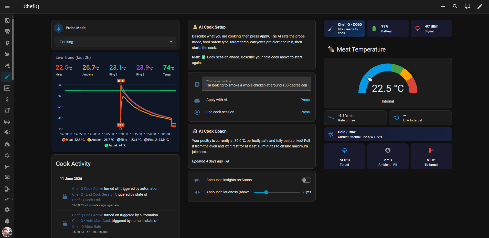
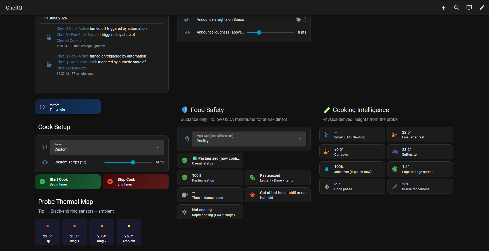
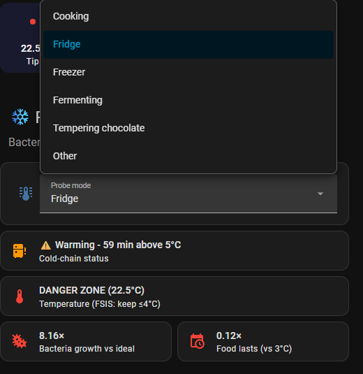
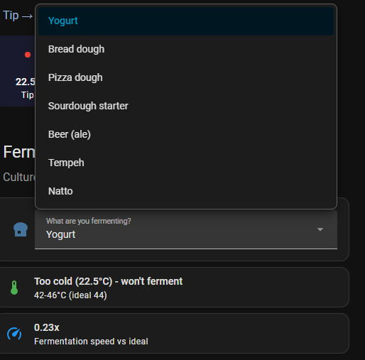

# Chef iQ BLE for Home Assistant

A native Home Assistant integration for the **Chef iQ CQ60 Smart Wireless Meat Thermometer** (and any other probe that broadcasts on manufacturer ID `0x05CD` / `1485`).

* **No cloud.** No Chef iQ account, no MQTT bridge, no BLE Monitor required.
* **Local push** via the Home Assistant Bluetooth integration. Works with any source HA already knows about — local USB HCI, ESPHome BT proxy, SLZB‑06 (LAN), Shelly BLE Gateway, etc.
* **Sentinel‑aware.** When a probe ring isn't in contact with anything (only the tip is inserted, ambient is exposed, etc.) the firmware emits a "not‑measured" value of `0x7FFB`. This integration masks those to **unavailable** instead of letting `3,276 °C` end up on your graphs.
* **Battery is properly scaled.** Raw 0–255 byte → 0–100 %.
* **Per‑probe config entries.** Each physical probe gets its own device card with all six rings, battery and signal as separate entities — auto‑discovered the moment HA sees a Chef iQ advert.
* **Multi‑probe ready.** Built for the 4‑probe Chef iQ set out of the box — wake each probe in turn, accept its discovery card, and you'll have one independent device + entity bundle per physical probe. See [Multiple probes](#multiple-probes) below.

## Quick links

* 🍳 **Full smart‑kitchen dashboard (with screenshots):** [`Docs/DASHBOARD.md`](Docs/DASHBOARD.md)
* 🤖 **All 27 automations + scripts:** [`Docs/AUTOMATIONS.md`](Docs/AUTOMATIONS.md)
* 📊 **Single‑probe dashboard:** [`examples/dashboard.yaml`](examples/dashboard.yaml)
* 📊 **Four‑probe dashboard:** [`examples/dashboard_multi_probe.yaml`](examples/dashboard_multi_probe.yaml)
* 🛠️ **Install:** [HACS — recommended](#install-hacs--recommended) · [Manual](#install-manual)
* 🍗 **Multi‑probe setup guide:** [Multiple probes](#multiple-probes)
* 🐛 **Issues / feature requests:** [GitHub issues](https://github.com/ITSpecialist111/ChefIQ_Probe_HomeAssistant_Integration/issues)

## Sensors per probe

| Entity | Description |
|---|---|
| `Meat temperature` | The deepest ring (the "meat" reading) |
| `Probe tip` | Tip of the probe |
| `Probe ring 1` / `2` / `3` | Other rings up the shaft |
| `Ambient temperature` | Handle‑end ring (use this for grill/oven temp) |
| `Battery` | 0–100 % |
| `Signal strength` | RSSI of the nearest BT source (disabled by default) |

Any ring that isn't in contact with anything reports as **unavailable** rather than a bogus number.

## Install (HACS — recommended)

1. In HACS → ⋮ → **Custom repositories**, add:
   * Repository: `https://github.com/ITSpecialist111/ChefIQ_Probe_HomeAssistant_Integration`
   * Type: **Integration**
2. Install **Chef iQ BLE**.
3. Restart Home Assistant.
4. Wake the probe (touch the capacitive button on the charger). HA's Bluetooth integration will surface a "Discovered" card — click **Configure → Submit**.

## Install (manual)

Copy `custom_components/chefiq_ble/` into your HA `config/custom_components/` directory and restart HA.

## Why not just use BLE Monitor?

BLE Monitor is brilliant, but historically its bundled Chef iQ parser:

* surfaced probe rings that aren't in contact as `~3,276 °C` (now fixed upstream — see the note below),
* doesn't scale battery from raw byte to percentage,
* and on Home Assistant OS only supports the **local** HCI adapter — it can't ingest from an SLZB‑06 or any other remote scanner that HA's first‑party Bluetooth integration knows about.

This integration is an end run around all three of those — it sits directly on `homeassistant.components.bluetooth`, so any source that integration sees, this one sees too.

(The sentinel fix has since been merged into BLE Monitor via [PR #1538](https://github.com/custom-components/ble_monitor/pull/1538), so recent BLE Monitor versions no longer show the `~3,276 °C` readings — handy if you prefer to stay on BLE Monitor.)

## Multiple probes

The integration is **per‑probe by design** — each physical CQ60 you pair becomes its own config entry, its own HA device, and its own bundle of `meat / probe_tip / probe_1 / probe_2 / probe_3 / ambient / battery / signal` entities. There's no hard‑coded limit; the 4‑probe Chef iQ set works out of the box, and so does any number beyond that as long as your Bluetooth source(s) can hear all of them.

**To pair multiple probes:**

1. Wake **probe 1** (touch the dock button), accept its discovery card.
2. Wake **probe 2**, accept its discovery card. Repeat for 3, 4, …
3. **Rename each device** straight away under *Settings → Devices & Services → Chef iQ BLE → \<device\> → pencil icon* to something meaningful (`Brisket`, `Chicken`, `Pork`, `Ambient`, …). Entity IDs follow the device name, so renaming gives you readable IDs like `sensor.brisket_meat_temperature` instead of the default `sensor.chef_iq_cq60_2_meat_temperature`.

Each probe broadcasts independently, so signal loss / battery / firmware sentinel handling is fully isolated — one probe going *unavailable* never affects the others.

## Dashboards

Two ready‑to‑paste Lovelace dashboards live in [`examples/`](examples/). Both are pure YAML — open *Settings → Dashboards → + Add Dashboard → Edit → ⋮ → Raw Configuration Editor* and paste the contents of whichever file matches your setup.

| File | When to use it |
|---|---|
| [`examples/dashboard.yaml`](examples/dashboard.yaml) | **One probe.** Gauge + entity list + 1‑hour history graph. The simplest possible starting point. |
| [`examples/dashboard_multi_probe.yaml`](examples/dashboard_multi_probe.yaml) | **Two or more probes** (built around the Chef iQ 4‑probe set). Sections layout with one card group per probe (gauge + ambient + battery + tip), a combined 2‑hour `history-graph` across all probes, and a commented Jinja snippet for a "hottest probe" template sensor. |

Both examples assume the default auto‑generated entity IDs (`sensor.chef_iq_cq60_*`, `sensor.chef_iq_cq60_2_*`, …). If you've renamed your devices to something more descriptive (highly recommended — see [Multiple probes](#multiple-probes)), do a find/replace on the entity prefix once and you're done.

### Full “smart kitchen” dashboard

The richer dashboard from the project screenshots — doneness gauge, per‑ring thermal map, live
trend, a **Food Safety** column (pasteurization, lethality, danger‑zone, hot‑hold, rapid‑cooling), a
**Cooking Intelligence** column (Newton’s‑law ETA, carryover, juiciness, cook phase), plus
mode‑aware **Fridge / cold‑chain**, **Fermenting / proofing** and **Chocolate tempering** views, an
optional **AI cook assistant** and **Sonos announcements** — is fully documented here:

### 📖 [**Docs/DASHBOARD.md**](Docs/DASHBOARD.md) · 🤖 [**Docs/AUTOMATIONS.md**](Docs/AUTOMATIONS.md)

Everything it needs ships in [`examples/`](examples/): the dashboard
([`dashboard_full.yaml`](examples/dashboard_full.yaml)), the derived template sensors
([`cooking_physics_package.yaml`](examples/cooking_physics_package.yaml)), the 27 automations
([`chefiq_automations.yaml`](examples/chefiq_automations.yaml)), the scripts
([`chefiq_scripts.yaml`](examples/chefiq_scripts.yaml)) and the AI / Sonos add‑ons.

| Cooking overview | Food safety & cooking intelligence |
|---|---|
|  |  |
| **Fridge / cold‑chain mode** | **Fermenting / proofing mode** |
|  |  |

## Compatibility

* Home Assistant **2024.4** or newer.
* Tested with Chef iQ **CQ60** firmware as shipped in late 2024 / 2025. Other Chef iQ probes that share the manufacturer ID may partially work — please open an issue with a packet capture if you have one.

## Credits

Manufacturer‑data layout reverse‑engineered from on‑device captures and cross‑referenced with the parser in [`custom-components/ble_monitor`](https://github.com/custom-components/ble_monitor/blob/master/custom_components/ble_monitor/ble_parser/chefiq.py).

## License

[MIT](LICENSE).
