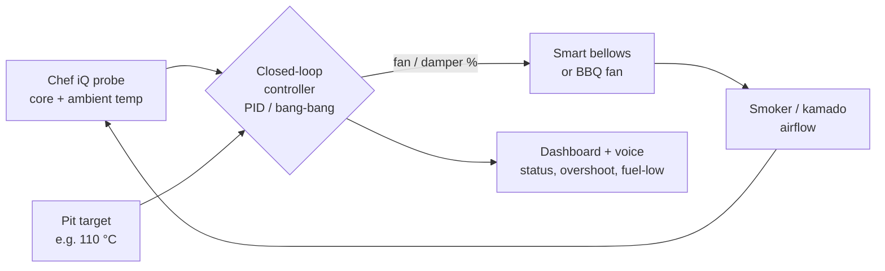

# Chef iQ BLE — Roadmap

This roadmap captures where the project is heading. It grew out of the integration’s own
experimentation plus a wide‑ranging conversation with the Chef iQ product team about extending the
probe ecosystem. It’s a **living document and a set of directions, not dated commitments** — ideas,
issues and PRs are very welcome.

The throughline: **move from *monitoring* temperature to *understanding* and *acting on* a cook** —
let people express *intent* (“whole chicken at 130 °C over three hours”), fuse multiple signals
(core + ambient + appliance), and where safe, close the loop to actively hold conditions.

---

## ✅ Already shipped (v1.x)

Much of the “intelligent assistant” vision is already in the integration today:

- **Conversational cook setup** — describe a cook in plain English and the AI configures probe mode,
  food‑safety type, target temp, carryover, pre‑alert and rest. → [`examples/ai_cook_setup.yaml`](examples/ai_cook_setup.yaml)
- **AI cook coach** — periodic, context‑aware insight while cooking. → [`examples/ai_cook_coach.yaml`](examples/ai_cook_coach.yaml)
- **Cooking‑physics engine** — Newton’s‑law ETA, dynamic carryover, predicted final / rested temp,
  juiciness, doneness spread, cook phase. → [`examples/cooking_physics_package.yaml`](examples/cooking_physics_package.yaml)
- **Food‑safety lifecycle** — pasteurization %, lethality, danger‑zone timer, hot‑hold and **FDA
  2‑stage cooling‑curve** tracking with “safe to refrigerate” guidance.
- **Voice‑first guidance** — spoken Sonos/TTS announcements for pull point, pasteurization, cooling,
  stalls, etc. → [`examples/kitchen_announce.yaml`](examples/kitchen_announce.yaml)
- **Mode‑aware coaching** — fridge / cold‑chain, fermenting / proofing, chocolate tempering.
- **Proxy‑friendly local telemetry** — works through ESPHome / SLZB‑06 / Shelly BLE, no cloud.

See [DASHBOARD.md](Docs/DASHBOARD.md) and [AUTOMATIONS.md](Docs/AUTOMATIONS.md) for the full picture.

---

## 🎯 Near term

Polish and broaden what already exists.

- **Express intent, not presets** — richer natural‑language setup: arbitrary target temps and
  durations (“low and slow to 92 °C over ~10 h”), not just weight + appliance presets.
- **Dynamic ETA you can trust** — continuously‑updated finish estimates that adapt to stalls and
  temperature swings, surfaced as a countdown + confidence band.
- **Configurable notify/announce targets** — move the hardcoded `notify.*` / Sonos entities in the
  example automations to a small set of helpers so they’re drop‑in for any household.
- **Per‑probe automation blueprints** — package the 27 automations as HA **blueprints** so
  multi‑probe users can stamp out a set per cook with a couple of inputs.
- **Multi‑probe roll‑up views** — “hottest probe”, per‑probe ETA, and a combined safety verdict.

---

## 🚀 Mid term — Open ecosystem & connected appliances

Bring **appliance** signals alongside the probe so the dashboard reflects the *whole* cook, not just
the meat.

- **Ambient / pit temperature as a first‑class input** — already read from the handle‑end ring;
  formalise it for grill/oven/smoker context and drift alerts.
- **Smart oven / smoker integrations** — surface appliance setpoint vs. actual, door/lid events and
  recovery time after opening.
- **Sensor fusion** — combine **internal meat temp + ambient cooking temp + appliance state** into a
  single cook model (e.g. detect “lid open”, “fuel low”, “stall vs. genuinely done”).
- **Open telemetry out** — publish a clean event/state stream (and optionally MQTT) so other systems
  and experiments can subscribe to a cook.

---

## 🔥 Flagship idea — Closed‑loop cooking with a smart bellows

> *The headline experiment: stop merely **reporting** pit conditions and start **maintaining** them.*

Long‑duration BBQ/smoking lives and dies by a **stable pit temperature**. Today the probe tells you
the pit is drifting; a **smart bellows / fan** can actually *do something about it*. The goal is a
**closed‑loop controller** that uses probe telemetry to drive airflow and hold the pit on target —
turning a manual babysitting job into an autonomous cook.

**How it would work**

- **Inputs:** ambient/pit temperature (probe), core meat temp, target pit temp, and limits (max
  fan %, overshoot guard).
- **Controller:** a PID (or simpler bang‑bang with hysteresis) HA control loop that maps pit error →
  fan/damper output.
- **Output:** a smart bellows / BBQ blower exposed to HA — e.g. via **ESPHome** (PWM fan + servo
  damper) for a DIY build, or existing controllers like **BBQ Guru, Flame Boss, Fireboard Drive**
  where an API/local control is available.
- **Safety & intelligence:** overshoot protection, **lid‑open detection** (pause the loop when
  ambient craters), **fuel/stall reasoning** (fan pinned at 100 % but temp still falling → “add
  fuel”), and a hard “core temp reached → wind the pit down” handoff to the existing pull‑point and
  rest logic.

**Why it’s a natural fit here:** the integration already has the *ambient* signal, the *cook phase*
and *stall* detection, the *food‑safety* model and the *voice* layer — the bellows just adds the
**actuator** that turns insight into action. Closing that loop is the difference between a probe that
*watches* a cook and a system that *runs* one.

**Likely path:** start with a generic “fan %” entity + a configurable PID package (works with any
ESPHome blower), then add adapters for the popular commercial controllers.

---

## 👁️ Longer term — Computer vision & sensor fusion

Add what the probe *can’t* see — an **“outside‑in”** view to complement inside‑out telemetry.

- **Visual doneness & state cues** — bark colour, surface render, smoke/flare‑up detection from a
  grill/pit camera, fused with probe data.
- **Local AI processing** — on‑device vision (privacy‑friendly) feeding the same coach that already
  reasons over the physics + safety sensors.
- **Multimodal coach** — combine numbers (probe), context (appliance) and pictures (camera) into one
  recommendation (“bark’s set and core’s at 90 °C — wrap now”).

---

## ♿ Cross‑cutting — Food safety & accessibility

A first‑class, ongoing priority rather than a single milestone.

- **Cooling‑curve coaching** (shipped) → expand with smarter “safe to refrigerate / discard” calls.
- **Voice‑first interaction** — spoken setup, status and alerts for users who prefer or need a
  hands‑free / non‑visual experience.
- **Clear, inclusive guidance** — plain‑language safety prompts, not just numbers on a gauge.

---

## How to contribute / suggest

- 💡 **Ideas & feedback:** open a [GitHub issue](https://github.com/ITSpecialist111/ChefIQ_Probe_HomeAssistant_Integration/issues)
  (tag it `roadmap` / `enhancement`).
- 🔧 **Experiments welcome:** the smart‑bellows loop in particular is a great community build —
  ESPHome fan/damper configs, controller adapters and PID tunings are all valuable PRs.
- 🌐 **Ecosystem note:** several items above (appliance APIs, telemetry access) depend on the wider
  Chef iQ / connected‑appliance ecosystem; those are exploratory and tracked here so the direction
  is visible even where it’s not yet buildable.

> Roadmap items are aspirational and may change. Nothing here implies a delivery date or a
> commitment from Chef iQ.
